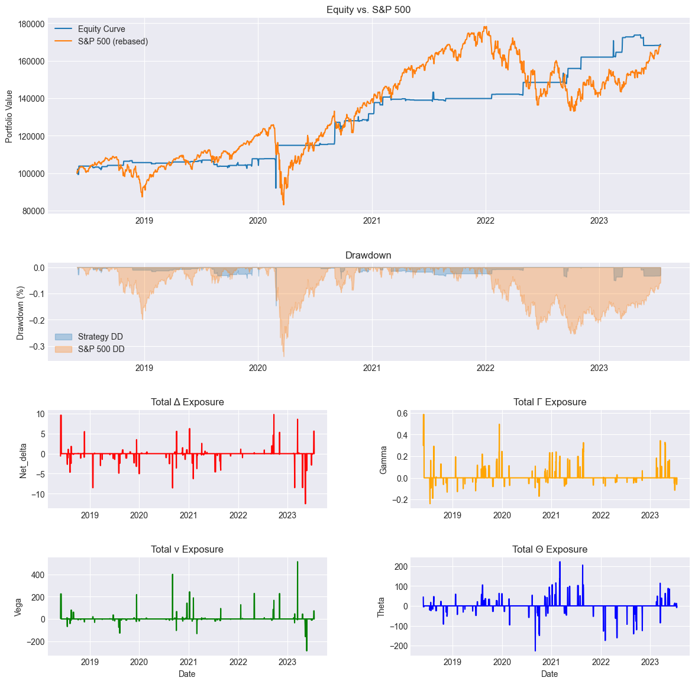
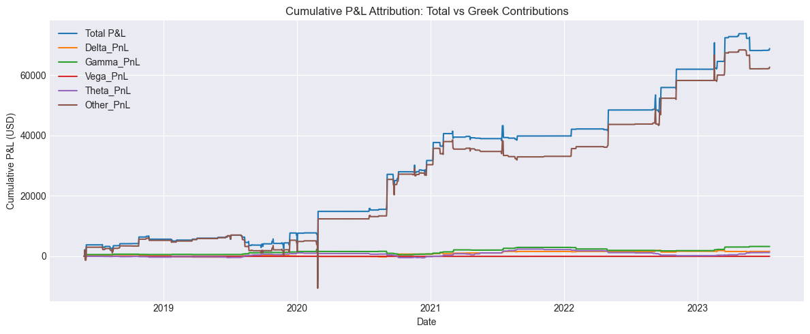

# **Volatility Trading on Index Equity Options**

This projects presents several daily volatility trading strategies on SPX Index Equity Options.
Each strategy is thoroughly backtested and appropriate risk management constraints are considered.

## **Example: Skew Volatility Trading (30 DTE / 25 Δ)**

Trade the 30-day to expiry, 25 Delta SPX put–call skew via a delta-hedged risk reversal:

- **Synthetic Skew**  
  – Interpolate across expiries to build a continuous “30 DTE / 25 Δ” skew series.  

- **Entry / Exit**  
  – **Short RR** when skew z-score ≥ 1.5 (too steep)  
  – **Long RR** when skew z-score ≤ –1.5 (too flat)  
  – **Exit** when |z-score| ≤ 0.5  

- **Delta Hedge**  
  – Neutralize net Δ with E-mini S&P 500 futures (ES=F, lot_size = 50)  

---

### **Signal Filters**
- **VIX Filter:** Block entries if VIX > 30  
- **IV Percentile:** Trade only when ATM IV is within its 20–80 historical percentile  
- **Skew Percentile:** Trade only when skew is below its 30th (for longs) or above its 70th (for shorts) percentile  

---

### Backtest Overview
We run a walk-forward backtest on daily SPX options (2016 – 2023), starting with \$100 000 of capital.

### Configuration

- **Entry Rule**  
50-day z-score mean-reversion on normalized skew (|z| ≥ 1.5 triggers a risk reversal; exit when |z| falls below 0.5)

- **Signal Filters**  
  - **VIX Filter:** Skip trades when VIX > 30  
  - **Skew Percentile:** Only go long when normalized skew falls below its 30th percentile, and short when it rises above its 70th percentile   

- **Execution Costs**  
  - **Bid/Ask & Slippage:** Fill sells at the bid, buys at the ask + \$0.01 slippage per leg  
  - **Commissions:** \$1 per option leg  

- **Risk Controls**
  - **Delta Hedging:** E-mini S&P 500 futures (ES=F) used to neutralize net Δ (lot_size=50)
  - **Position Sizing:** Dynamically scale trade size by signal strength (base 1% of equity at entry-threshold, +0.5% per additional 0.5σ) and cap it at 2%
  - **Risk Floor:** Enforce a minimum \$750 worst-case risk per contract to prevent oversized position sizing when Greek-based risk is very low    
  - **Stop-Loss & Take-Profit:** SL at 100% of notional, TP at 70% of notional  
  - **Holding Period Cap:** 3 business days (skip negative theta trades on Fridays if 2-day θ decay > 200)

### Performance Results

### 🔍 **Overall Performance Metrics**

| Metric                    | Value          |
|:--------------------------|:--------------:|
| **Sharpe Ratio**          | 0.61           |
| **CAGR**                  | 10.73%         |
| **Average Drawdown**      | –1.62%         |
| **Max Drawdown**          | –14.61%        |
| **Max Drawdown Duration** | 287 days       |
| **Historical VaR (99%)**  | –0.87%         |
| **Historical CVaR (99%)** | –2.64%         |
| **Total P&L**             | \$68,754.99    |
| **Profit Factor**         | 2.66           |
| **Trade Frequency**       | 15.2 trades/yr |
| **Total Trades**          | 78             |
| **Win Rate**              | 62.82%         |
| **Avg Win P&L**           | \$2,271.04     |
| **Avg Loss P&L**          | –\$1,444.52    |

---

### 📊 **Performance by Contract Size**

| Contracts | Win Rate | # Trades | Total Win P&L | Total Loss P&L | Total P&L   |
|:---------:|:--------:|:--------:|:-------------:|:--------------:|:-----------:|
| 1         | 55%      | 40       | \$21,428.50   | –\$17,391.50   | \$4,037.00  |
| 2         | 68%      | 28       | \$69,038.00   | –\$15,731.00   | \$53,307.00 |
| 3         | 75%      | 8        | \$13,990.50   | –\$8,768.50    | \$5,222.00  |
| 4         | 100%     | 2        | \$6,823.99    | \$0.00         | \$6,823.99  |